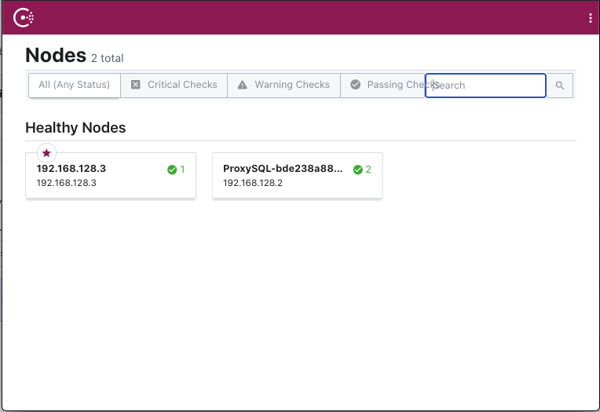
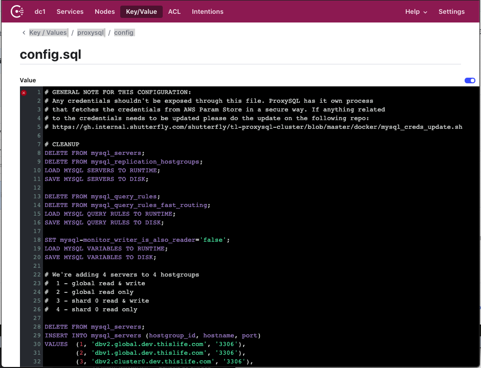

[](https://events.hashicorp.com/hashitalkslatinamerica)

#Dynamic ProxySQL configuration with Consul

This demo showcases how to implement a dynamic configuration using Consul. This demo creates a couple of containers:

- Consul
- Proxysql

##Prerequisites:

1. Linux distribution to run the demo
2. Docker & docker-compose
3. Terraform

##Initialize Demo:

```
% start_environment.sh
```

Once the demo is running you should be able to see them running:

```
% docker-compose ps
                 Name                               Command               State                                                                      Ports
------------------------------------------------------------------------------------------------------------------------------------------------------------------------------------------------------------------------------
proxysql_config_with_consul_consul_1     /opt/bitnami/scripts/consu ...   Up      0.0.0.0:8300->8300/tcp, 0.0.0.0:8301->8301/tcp, 0.0.0.0:8301->8301/udp, 0.0.0.0:8500->8500/tcp, 0.0.0.0:8600->8600/tcp,
                                                                                  0.0.0.0:8600->8600/udp
proxysql_config_with_consul_proxysql_1   /usr/bin/supervisord             Up      10000/tcp, 12000/tcp, 0.0.0.0:33026->6032/tcp, 0.0.0.0:33025->6033/tcp, 0.0.0.0:33024->6080/tcp, 0.0.0.0:33023->8300/tcp,
                                                                                  0.0.0.0:33022->8301/tcp, 8301/udp, 0.0.0.0:33021->8302/tcp, 8302/udp, 0.0.0.0:33020->8500/tcp, 0.0.0.0:33019->8501/tcp,
                                                                                  0.0.0.0:33018->8502/tcp, 0.0.0.0:33017->8600/tcp, 8600/udp
```

You should be able to see Consul dashboard on the following URL:

[http://localhost:8500](http://localhost:8500)



## Making changes to the configuration

Once you have consul, you can see that the ProxySQL configuration is located as KV under `Key/Value>proxysql>config.sql`



You can validate the ProxySQL existing configuration inside the container by running the following commands:

```
% docker exec -it proxysql_config_with_consul_proxysql_1 bash
```
```
root@bde238a88825:/# mysql -u admin -padmin -h 127.0.0.1 -P6032 -e "SELECT * FROM mysql_servers;"
+--------------+--------------------------------+------+-----------+--------+--------+-------------+-----------------+---------------------+---------+----------------+---------+
| hostgroup_id | hostname                       | port | gtid_port | status | weight | compression | max_connections | max_replication_lag | use_ssl | max_latency_ms | comment |
+--------------+--------------------------------+------+-----------+--------+--------+-------------+-----------------+---------------------+---------+----------------+---------+
| 2            | dbv2.global.dev.thislife.com   | 3306 | 0         | ONLINE | 1      | 0           | 1000            | 0                   | 0       | 0              |         |
| 4            | dbv2.cluster0.dev.thislife.com | 3306 | 0         | ONLINE | 1      | 0           | 1000            | 0                   | 0       | 0              |         |
| 4            | dbv1.cluster0.dev.thislife.com | 3306 | 0         | ONLINE | 1      | 0           | 1000            | 0                   | 0       | 0              |         |
| 2            | dbv1.global.dev.thislife.com   | 3306 | 0         | ONLINE | 1      | 0           | 1000            | 0                   | 0       | 0              |         |
+--------------+--------------------------------+------+-----------+--------+--------+-------------+-----------------+---------------------+---------+----------------+---------+
root@bde238a88825:/# mysql -u admin -padmin -h 127.0.0.1 -P6032 -e "SELECT * FROM global_variables WHERE variable_name='mysql-monitor_username'";
+------------------------+----------------+
| variable_name          | variable_value |
+------------------------+----------------+
| mysql-monitor_username | test_user      |
+------------------------+----------------+
root@bde238a88825:/# mysql -u admin -padmin -h 127.0.0.1 -P6032 -e "SELECT username, password FROM mysql_users;"

```

Then you can make a change in any of the configurations in the Consul KV through the dashboard and validate that the ProxySQL configuration was reflected in the container.

You can also scale up the number of ProxySQL nodes and see that all have the same configuration:

```
docker-compose up --scale proxysql=5 -d
```

##Stop Demo:
```
% stop_environment.sh
```